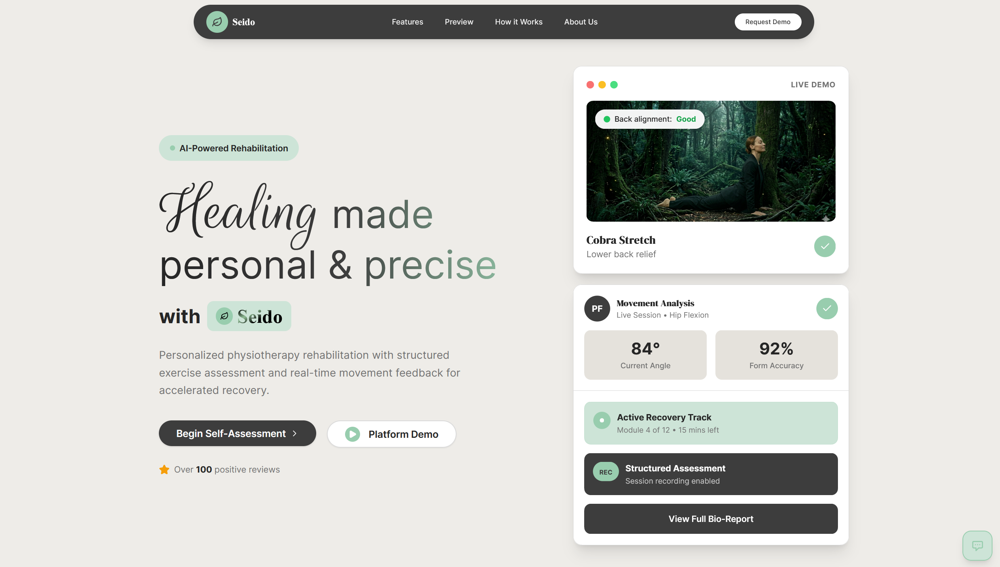
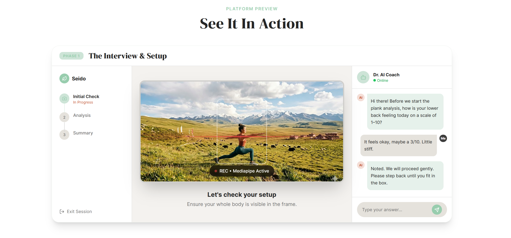

  

<h1 align="center">Seido</h1>

  <b>Mountain Madness 2026 Hackathon Winner 🥇</b> 
  Team Seido with Jerry, Mike, Ryan.

  <a href="#about-the-project"><b>About The Project</b></a>
  &nbsp;·&nbsp;
  <a href="#how-it-works"><b>How It Works</b></a>
  &nbsp;·&nbsp;
  <a href="#tech-stack"><b>Tech Stack</b></a>
  &nbsp;·&nbsp;
  <a href="#key-features"><b>Key Features</b></a>
  &nbsp;·&nbsp;
  <a href="#team"><b>Team</b></a>

  
  
  
  
  

---

## About The Project

Seido is an AI-powered rehabilitation platform designed to make physical therapy and recovery more personal, precise, and engaging. Users can participate in guided movement sessions, receive real-time feedback, and track their progress—all from the comfort of home.

### The Problem
Physical rehabilitation is often repetitive, hard to track, and lacks personalized feedback. Many patients struggle to stay motivated and perform exercises correctly, which can slow recovery and reduce outcomes.

### Our Solution
Seido provides a comprehensive platform where users can:
- Join interactive, AI-guided movement sessions
- Receive instant feedback on posture and exercise quality
- Track progress and session history
- Enjoy a beautiful, responsive experience on any device

  

## How It Works

1. **Start a Session**: Users select a rehabilitation session tailored to their needs.
2. **AI-Powered Guidance**: The system uses pose detection and smart algorithms to monitor movement and provide feedback.
3. **Real-Time Feedback**: Users see live scores and tips to improve their posture and exercise form.
4. **Session Summary**: After each session, users receive a summary and can export their progress.

## Tech Stack

**Frontend:**
- React with TypeScript
- Vite for fast development and builds
- Tailwind CSS for styling
- Radix UI and shadcn/ui for accessible components
- React Query for data fetching
- GSAP for animations

**Backend/Data:**
- AI-powered posture analysis (MediaPipe integration)
- Session data and summaries
- PDF export via jsPDF

## Key Features

- **AI-Powered Rehabilitation**: Real-time posture and movement analysis
- **Interactive Sessions**: Guided exercises with instant feedback
- **Progress Tracking**: Session summaries and exportable reports
- **Beautiful UI**: Modern, responsive design for all devices
- **Accessible Components**: Built with Radix UI and shadcn/ui
- **Fast & Reliable**: Powered by Vite and React Query
